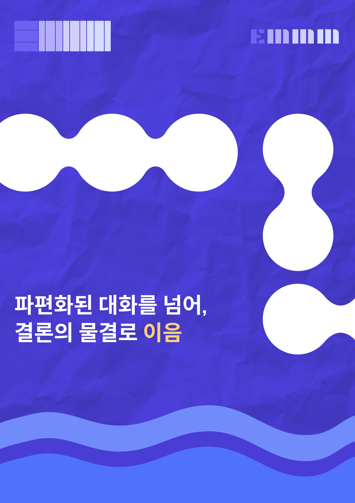
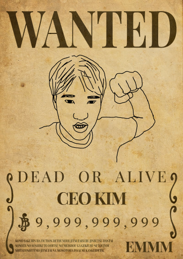
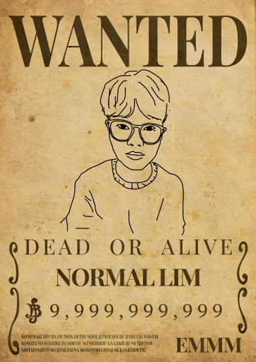
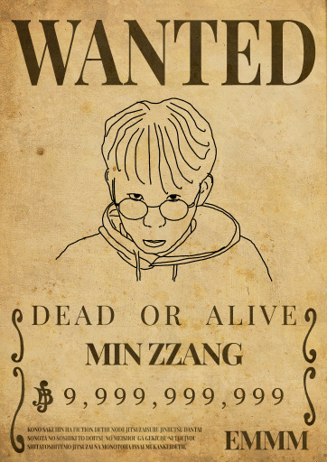
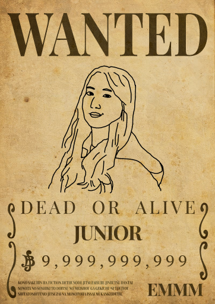
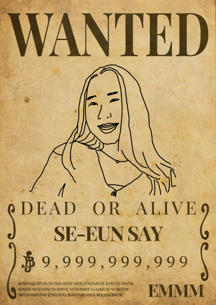
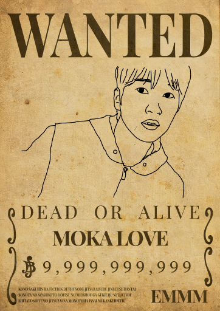

 

<table align="center" width="100%">
  <tr>
    <td width="55%" align="center">
      
    </td>
    <td width="45%" align="left" style="padding-left:40px; vertical-align:middle;">
      <h1 style="margin-bottom:10px;">Emmm 이음</h1>
      

        회의 안건 관리와 실시간 협업을 효율적으로 진행할 수 있는
        웹 기반 플랫폼입니다.
      

       
      <ul style="line-height:1.8;">
        <li> JWT 기반 인증 시스템</li>
        <li> WebSocket 실시간 채팅</li>
        <li> PDF 파일 공유 및 미리보기</li>
        <li> 투표 및 결과 집계 기능</li>
        <li> 회의 내용 AI요약</li>
      </ul>
    </td>
  </tr>
</table>

 
  

TEAM

<h1 align="center" style="font-size:48px; margin:10px 0;">
두먹사
</h1>

두쫀쿠 먹어본 사람들

한 번 경험하면 잊을 수 없는 것처럼,  
우리의 서비스도 한 번 쓰면 계속 찾게 되는 플랫폼이 되기를 바랍니다.

  
<table align="center" style="background-color:#f9f9f9; border-radius:20px; padding:20px; box-shadow:0 4px 12px rgba(0,0,0,0.1);">
  <tr>
    <th>FRONTEND</th>
    <th>FRONTEND</th>
    <th>BACKEND</th>
  </tr>
  <tr>
    <td align="center">
       
      <b>김진성</b>
    </td>
    <td align="center">
       
      <b>임청명</b>
    </td>
    <td align="center">
       
      <b>김민제</b>
    </td>
  </tr>
</table>

 

<table align="center">
  <tr>
    <th>BACKEND</th>
    <th>PLANNER</th>
    <th>DESIGNER</th>
  </tr>
  <tr>
    <td align="center">
       
      <b>박주아</b>
    </td>
    <td align="center">
       
      <b>이세은</b>
    </td>
    <td align="center">
       
      <b>김예준</b>
    </td>
  </tr>
</table>

  

<h2 align="center" style="letter-spacing:2px;">CONTRIBUTION</h2>

 

<table align="center" width="90%">
<tr>
  <td width="20%"><b>김진성 (김대표)</b></td>
  <td width="20%" style="color:#777;">Frontend</td>
  <td>
    서비스 핵심 기능 프론트엔드 전반 담당 
    • 회의 페이지 UI 및 기능 구현 
    • 실시간 채팅(전체/DM) 및 타이머 구현 
    • 파일 공유, 투표 기능 개발 
    • AI 회의 요약 기능 연동
  </td>
</tr>

  <tr>
    <td><b>임청명 (난 분명이 말했어 안된다고)</b></td>
    <td style="color:#777;">Frontend</td>
    <td>
      로그인 & 회의방 검색/참여 기능 프론트엔드 전반 담당 
      • 로그인 및 랜딩 페이지 UI 구현 
      • 홈 화면 및 방 목록 조회 페이지 개발 
      • 사용자 흐름 기반 초기 화면 구조 설계
    </td>
  </tr>

  <tr>
    <td><b>김민제 (민짱)</b></td>
    <td style="color:#777;">Backend</td>
    <td>
      서비스 전체 백엔드 전반 담당 
      • 파일 기능을 제외한 서버 기능 전반 담당 
      • JWT 기반 인증 시스템 구현 
      • 채팅, 투표, AI 요약 관련 REST API 개발 
      • 데이터 모델 설계 및 서버-클라이언트 연동 처리
    </td>
  </tr>

  <tr>
    <td><b>박주아 (막내)</b></td>
    <td style="color:#777;">Backend</td>
    <td>
      • 파일 업로드 및 저장 처리 로직 구현 
      • 파일 데이터 관리 및 예외 처리 
      • DM 관련 호스트와 참여자 간의 역할(Role) 기반 권한 제어 로직 구현 
      • 파일, DM 관련 REST API 개발
    </td>
  </tr>

  <tr>
    <td><b>이세은 (세은세이)</b></td>
    <td style="color:#777;">Planner</td>
    <td>
      • 서비스 기획 및 기능 정의 
      • 요구사항 정리 및 사용자 흐름 설계 
      • 프로젝트 일정 관리
    </td>
  </tr>

  <tr>
    <td><b>김예준 (모카사랑)</b></td>
    <td style="color:#777;">Designer</td>
    <td>
      • UI/UX 디자인 설계 
      • 서비스 브랜딩 및 시각 아이덴티티 구축 
      • 프로토타입 제작
    </td>
  </tr>

</table>

 
