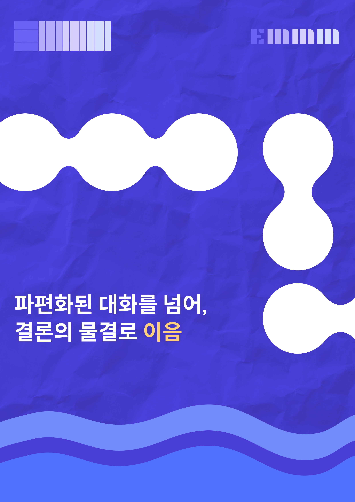
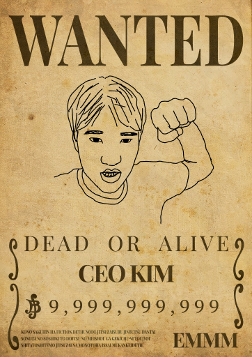
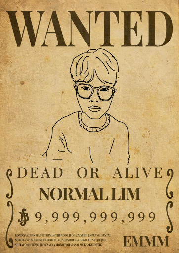
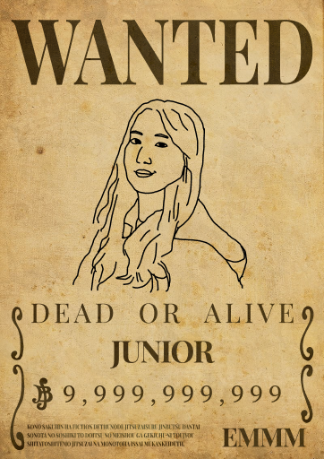
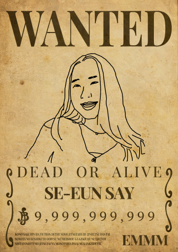
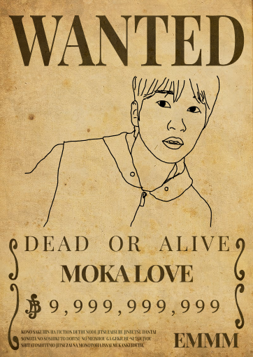

  

 

<table align="center" style="background-color:#f9f9f9; border-radius:20px; padding:20px; box-shadow:0 4px 12px rgba(0,0,0,0.1);">
  <tr>
    <th>FRONTEND</th>
    <th>FRONTEND</th>
    <th>BACKEND</th>
  </tr>
  <tr>
    <td align="center">
       
      <b>김진성</b>
    </td>
    <td align="center">
       
      <b>임청명</b>
    </td>
    <td align="center">
       
      <b>김민제</b>
    </td>
  </tr>
</table>

 

<table align="center">
  <tr>
    <th>BACKEND</th>
    <th>PLANNER</th>
    <th>DESIGNER</th>
  </tr>
  <tr>
    <td align="center">
       
      <b>박주아</b>
    </td>
    <td align="center">
       
      <b>이세은</b>
    </td>
    <td align="center">
       
      <b>김예준</b>
    </td>
  </tr>
</table>
